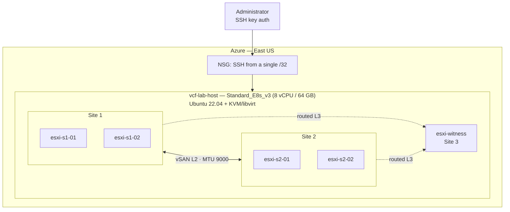

# VCF Stretched Cluster Sandbox on Azure (Terraform + Nested KVM)

Infrastructure as code and documentation for a **VMware vSAN Stretched Cluster** lab built on Azure for the *Private Cloud Design Exercise* technical test (Senior Private Cloud Engineer).

The goal is to demonstrate, inside a resource-constrained sandbox, the mechanics of a two-site stretched cluster plus a witness: fault domains, quorum, storage policy and behavior when a whole site fails.

> **Status:** infrastructure and ESXi hosts are deployed. The management layer (vCenter and vSAN) is **blocked by licensing**. See [Status and limitations](#status-and-limitations).

Spanish version: [README.md](README.md).

## Architecture



A single KVM host in Azure runs 5 nested ESXi 8.0.3 hosts (4 data hosts and 1 witness). Terraform provisions the Azure side; the rest is automated with `libvirt`, an ESXi kickstart and `esxcli` scripts.

## Why nested virtualization

The original design was one Azure VM per ESXi host. It was not viable for two reasons:

| Constraint | Effect |
|---|---|
| Subscription quota of ~9 vCPUs (18 planned) | The 4+4+witness design does not fit |
| ESXi cannot be installed on Azure VMs (synthetic Hyper-V devices, no ESXi drivers) | Not viable even with enough quota |

The solution was a single Azure VM running **KVM**, with the ESXi hosts as nested guests. The footprint is smaller than the target design (8 NVMe Ready Nodes), so the demo shows the stretched cluster mechanics, not production sizing.

## What is in this repository

| Path | Content |
|---|---|
| `main.tf`, `providers.tf`, `variables.tf`, `outputs.tf` | VNet, 3 subnets, NSG and the lab host VM |
| `modules/nested_host/` | Reusable module: VM, NIC, optional public IP and cache/capacity disks |
| `terraform.tfvars.example` | Variables template (copy to `terraform.tfvars`, which is not versioned) |
| `scripts/` | Host scripts: KVM, libvirt networks, ESXi kickstart, host configuration and the VCSA template |
| `Reporte_Ejecutivo_Detallado_Deployment_VCF_Sandbox.md` / `.docx` | Full technical report (in Spanish): networking, disks, security, incidents and remaining steps |
| `Resumen_Ejecutivo_Sesion_Sandbox_VCF.md` | Short progress summary (in Spanish) |
| `evidencia/` | Screenshots of the ESXi hosts and the Azure portal (personal data masked) |

## Requirements

- Terraform >= 1.5 and Azure CLI (`az login`)
- Access to an existing Resource Group with the Contributor role
- Quota for at least 8 vCPUs in a family that supports nested virtualization (Dv3/Ev3 or newer)
- An SSH public key
- Your public IPv4 in CIDR form (`curl -4 ifconfig.me`)
- ESXi and VCSA ISOs **with a valid license or evaluation** (not included)

## Usage

```bash
# 1. cp terraform.tfvars.example terraform.tfvars and fill in:
#    subscription_id, tenant_id, resource_group_name, location, admin_source_ip
# 2. Deploy
export TF_VAR_admin_ssh_public_key="$(cat ~/.ssh/id_rsa.pub)"
terraform init
terraform plan -out=tfplan
terraform apply tfplan

# 3. Connect to the lab host
ssh vcfadmin@$(terraform output -raw lab_host_public_ip)
```

After `apply`, run the scripts in [scripts/](scripts/) on the host in order: install KVM/libvirt and mount the data disks (`01`), create the routed `dc-stretch` and `witness` networks with MTU 9000 (`02`), serve the kickstart over HTTP (`03`), then create each ESXi with `mkesxi.sh` and configure it with `cfg-esxi.sh`. Scripts `01`–`03` were reconstructed from the commands that were run interactively and have not been re-run as scripts; the full procedure is in the report.

## Design decisions

- **Both data sites on one L2** (`dc-stretch`) and the **witness on L3**, with the host acting as router: this matches the stretched-L2 requirement and the correct practice for witness traffic.
- **Hybrid vSAN OSA:** cache flagged as SSD (through HPP) and capacity as HDD, because ESA requires real NVMe.
- **vSAN disks on Azure data disks**, not on the temporary disk, which is lost when the VM is deallocated.
- **Unattended ESXi install** through an HTTP-served kickstart, because the installer did not read the kickstart embedded in the rebuilt ISO.

## Security

- Administrative access is SSH key only; no passwords on the Azure VM.
- NSG allows SSH from a single `/32`; the ESXi hosts have no public IP.
- Azure access through PIM (Just-In-Time), scoped to one Resource Group.
- Known limitations and mitigations are in the report (section 7.4): the ESXi root password is a lab password and must be rotated.

## Status and limitations

| Component | Status |
|---|---|
| Azure network, NSG, VM and disks | Deployed |
| KVM/libvirt, host networks and storage | Ready |
| 5 ESXi 8.0.3 hosts (4 data + witness) with vSAN network | Installed and reachable |
| vCenter (VCSA) | **Blocked** |
| vSAN Stretched Cluster | **Pending** |

**Cause of the blocker:** the ESXi 8.0U3e ISO ships with the embedded free *vSphere 8 Hypervisor* license, which leaves the API read-only. That prevents deploying vCenter and enabling vSAN (`RestrictedVersion`). In addition, the VCSA used (8.0U3b) is older than the hosts, and vCenter cannot manage hosts newer than itself.

To continue, a valid license (vSphere + vSAN) or an official VCF/VVF evaluation ISO is needed, with ESXi and VCSA at the same version. The report includes the commands to finish the rest: VCSA deployment, fault domains, stretched cluster, storage policy and a site-failure test.

## Notes for publishing or reuse

- The subscription and tenant IDs are variables (`subscription_id`, `tenant_id`), not hard-coded in `providers.tf`.
- The [.gitignore](.gitignore) excludes Terraform state, plans, `*.tfvars` and the VMware ISOs.
- `ks.cfg` and `vcsa.json` use the placeholder `CHANGE_ME_LAB_PASSWORD`: replace it before use.
- Screenshots in `evidencia/` have the email, tenant and subscription ID masked.
- VMware ISOs are not redistributed; obtain them from Broadcom with a valid entitlement.

## Author

Jorge Daniel Mago Vera
