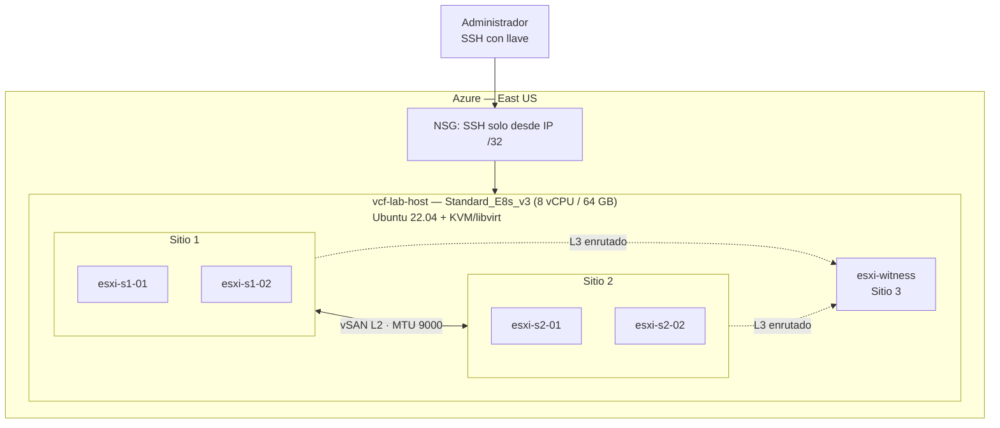

# VCF Stretched Cluster Sandbox en Azure (Terraform + KVM anidado)

Infraestructura como código y documentación de un laboratorio de **VMware vSAN Stretched Cluster** construido en Azure para el ejercicio técnico *Private Cloud Design Exercise* (Senior Private Cloud Engineer).

El objetivo es demostrar, en un sandbox con recursos limitados, la mecánica de un clúster extendido de dos sitios más un witness: dominios de falla, quórum, política de almacenamiento y comportamiento ante la caída de un sitio.

> **Estado:** infraestructura y hosts ESXi desplegados. La capa de gestión (vCenter y vSAN) está **bloqueada por licenciamiento**. Ver [Estado y limitaciones](#estado-y-limitaciones).

## Arquitectura



Un único host KVM en Azure ejecuta 5 hosts ESXi 8.0.3 anidados (4 de datos y 1 witness). Terraform provisiona la parte de Azure; el resto se automatiza con `libvirt`, un kickstart de ESXi y scripts de `esxcli`.

## Por qué virtualización anidada

El diseño original era una VM de Azure por host ESXi. No fue viable por dos razones:

| Restricción | Efecto |
|---|---|
| Cuota de la suscripción de ~9 vCPUs (18 planeadas) | El diseño de 4+4+witness no cabe |
| ESXi no se instala en VMs de Azure (dispositivos sintéticos de Hyper-V sin driver en ESXi) | Inviable aunque hubiera cuota |

La solución fue una sola VM de Azure con **KVM** y los ESXi como invitados anidados. La huella es menor que la del diseño objetivo (8 Ready Nodes NVMe), así que la demo muestra la mecánica del stretched cluster, no el dimensionamiento de producción.

## Qué incluye este repositorio

| Ruta | Contenido |
|---|---|
| `main.tf`, `providers.tf`, `variables.tf`, `outputs.tf` | VNet, 3 subredes, NSG y VM anfitriona |
| `modules/nested_host/` | Módulo reutilizable: VM, NIC, IP pública opcional y discos de caché/capacidad |
| `terraform.tfvars.example` | Plantilla de variables (copiar a `terraform.tfvars`, que no se versiona) |
| `scripts/` | Scripts del anfitrión: KVM, redes libvirt, kickstart de ESXi, configuración de hosts y plantilla del VCSA |
| `Reporte_Ejecutivo_Detallado_Deployment_VCF_Sandbox.md` / `.docx` | Reporte técnico completo: redes, discos, seguridad, incidentes y pasos restantes |
| `Resumen_Ejecutivo_Sesion_Sandbox_VCF.md` | Resumen breve del avance |
| `evidencia/` | Capturas de los hosts ESXi y del portal de Azure (con datos personales tapados) |

Versión en inglés: [README.en.md](README.en.md).

## Requisitos

- Terraform >= 1.5 y Azure CLI (`az login`)
- Acceso a un Resource Group existente con rol Contributor
- Cuota de al menos 8 vCPUs en una familia que soporte virtualización anidada (Dv3/Ev3 o superior)
- Llave SSH pública
- Tu IP pública en formato CIDR (`curl -4 ifconfig.me`)
- ISOs de ESXi y VCSA **con licencia o evaluación válida** (no se incluyen)

## Uso

```bash
# 1. cp terraform.tfvars.example terraform.tfvars y completar:
#    subscription_id, tenant_id, resource_group_name, location, admin_source_ip
# 2. Desplegar
export TF_VAR_admin_ssh_public_key="$(cat ~/.ssh/id_rsa.pub)"
terraform init
terraform plan -out=tfplan
terraform apply tfplan

# 3. Conectar al anfitrión
ssh vcfadmin@$(terraform output -raw lab_host_public_ip)
```

Después del `apply`, en el anfitrión se ejecutan los scripts de [scripts/](scripts/) en orden: instalar KVM/libvirt y montar los discos de datos (`01`), crear las redes `dc-stretch` y `witness` con MTU 9000 enrutadas (`02`), servir el kickstart por HTTP (`03`) y crear cada ESXi con `mkesxi.sh` y configurarlo con `cfg-esxi.sh`. Los scripts `01`–`03` se reconstruyeron a partir de los comandos ejecutados y no se han vuelto a correr como scripts; los pasos completos están en el reporte.

## Decisiones de diseño

- **Dos sitios de datos en un mismo L2** (`dc-stretch`) y **witness en L3**, con el anfitrión como router: refleja el requisito de L2 extendido y la práctica correcta para el tráfico de witness.
- **vSAN OSA híbrido:** caché marcada como SSD (vía HPP) y capacidad como HDD, porque ESA exige NVMe real.
- **Discos de vSAN en discos de datos de Azure**, no en el disco temporal, que se pierde al desasignar la VM.
- **Instalación desatendida de ESXi** por kickstart HTTP, porque el instalador no leyó el kickstart embebido en el ISO reconstruido.

## Seguridad

- Acceso administrativo solo por SSH con llave; sin contraseñas en la VM de Azure.
- NSG con SSH restringido a una IP `/32`; los ESXi no tienen IP pública.
- Acceso a Azure mediante PIM (Just-In-Time), limitado a un Resource Group.
- Limitaciones conocidas y mitigaciones en el reporte (sección 7.4): la contraseña de root de los ESXi es de laboratorio y debe rotarse.

## Estado y limitaciones

| Componente | Estado |
|---|---|
| Red, NSG, VM, discos en Azure | Desplegado |
| KVM/libvirt, redes y almacenamiento del anfitrión | Listo |
| 5 hosts ESXi 8.0.3 (4 datos + witness) con red vSAN | Instalados y accesibles |
| vCenter (VCSA) | **Bloqueado** |
| vSAN Stretched Cluster | **Pendiente** |

**Causa del bloqueo:** el ISO de ESXi 8.0U3e trae incorporada la licencia gratuita *vSphere 8 Hypervisor*, que deja la API en solo lectura. Eso impide desplegar vCenter y habilitar vSAN (`RestrictedVersion`). Además, el VCSA usado (8.0U3b) es anterior a los hosts, y vCenter no puede administrar hosts más nuevos que él.

Para continuar hace falta una licencia válida (vSphere + vSAN) o un ISO con evaluación oficial de VCF/VVF, ambos de la misma versión. El reporte incluye los comandos para completar el resto: despliegue del VCSA, fault domains, stretched cluster, política de almacenamiento y prueba de caída de sitio.

## Notas para publicar o reutilizar

- El ID de suscripción y el tenant son variables (`subscription_id`, `tenant_id`), no valores fijos en `providers.tf`.
- El [.gitignore](.gitignore) excluye el estado de Terraform, los planes, `*.tfvars` y los ISOs de VMware.
- Los scripts `ks.cfg` y `vcsa.json` usan el marcador `CHANGE_ME_LAB_PASSWORD`: reemplazarlo antes de usarlos.
- Las capturas de `evidencia/` tienen el correo, el tenant y el ID de suscripción tapados.
- Los ISOs de VMware no se redistribuyen; deben obtenerse de Broadcom con derecho de uso.

## Autor

Jorge Daniel Mago Vera
